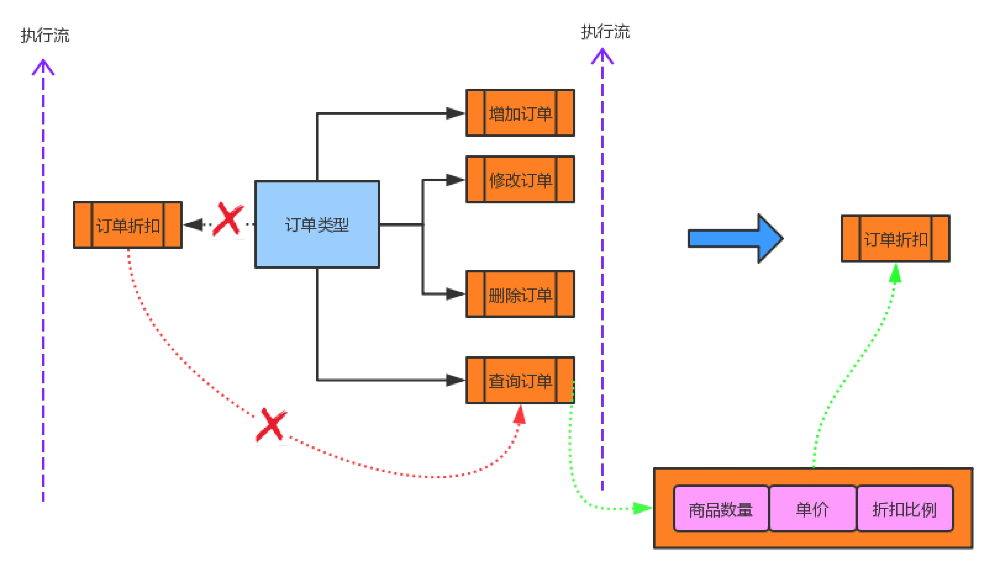

# 单一职责原则

SRP: 就一个类而言,应该仅有一个引起它变化的原因。

* 职责是"变化的原因和动机",确定粒度的关键。
* 每个职责都是一个变化轴线,反应需求变化。
* 承担职责过多,会造成耦合,以及脆弱设计。
* 最简单,也是最难正确运用的职责之一。


### 定义
SRP原则是,一个类型/实例确定后,应该仅有一个引起它变化的原因，就是对它本身状态修改,将这些职责和它本身绑定一起。每个变化就是类的一个职责,当需要变化时,对应的反映为职责的变化。

如果一个类型承担多个职责,那么引起类型变化的原因就有多个,等于就把这些职责耦合化了。


### 实例

在电商平台中,一个订单类型,应该有它本身的状态。如:增加订单、删除订单、更新订单和查询订单。如果赶上双11会对商品进行促销,那么商品折扣是否也属于订单本身的状态?

从设计角度分析,折扣没有必要和商品订单类型绑定在一起。因为,订单是有状态的,而折扣更像是一种算法,通过传入单价、数量、折扣比例等作为参数,最终输出商品价格。

从电商角度考虑,订单类型稳定性相比折扣稳定性更高。折扣可能经常被修改,所以将折扣这种不稳定类型和订单这种稳定类型绑定一起,会导致订单稳定性变为不稳定。


经过思考和分析后,可以将这种架构设计进行解耦。


```
type Order struct {}


func (o *Order) AddOrder() {
    // TODO: add order
}

func (o *Order) UpdateOrder() {
    // TODO: update order
}

func (o *Order) DeleteOrder() {
    // TODO: delete order
}

func (o *Order) SelectOrder() {
    // TODO: select order
}

func Discount(price float64, mount uint64, discount float64) float64 {
    f := float64(mount)
    cost := price * f * discount
    return cost
}
```



